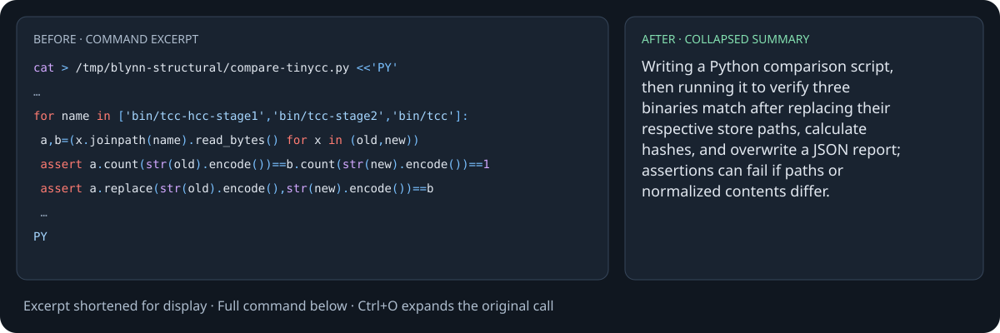

# Pi Tool Summaries

Plain-language summaries of tool calls.

Collapsed Bash calls show what the agent intends to do: “Searching TypeScript files for `oldApi` and printing the matches.” Press **Ctrl+O** to see the entire original command, including multiline scripts and heredocs.

Summaries run in the background using **your currently selected Pi model**. Tool execution and native results stay unchanged. While a summary is pending or unavailable, the original call remains visible.

## Install

Requires **Pi 0.84.4+** and Node 22.19+. Tested with Pi 0.84.4, 0.99.2, and 1.0.0.

```sh
pi install git:github.com/siraben/pi-tool-summaries
```

Restart Pi or run `/reload`. Use `/tool-summaries` to inspect the effective model and status.

## Before and after

The compiler-binary comparison below shows an existing command and its summary from this README.



Press **Ctrl+O** to expand the original command; tool results remain unchanged.

### Compare compiler binaries

<details>
<summary>Before: full Bash command</summary>

```sh
cat > /tmp/blynn-structural/compare-tinycc.py <<'PY'
"""Compare artifacts; normalize only the exact expected installation prefix."""
from pathlib import Path
import hashlib,json
old=Path('/nix/store/616qf0b4c1jpfd45i9g9zss94gcgya48-tinycc-boot-hcc-m2-precisely-m2-unstable-2025-12-03')
new=Path('/nix/store/4mjpbm5w9246lig1lhm8p2wxmn3j0vzq-tinycc-boot-hcc-m2-precisely-m2-unstable-2025-12-03')
rows=[]
for name in ['bin/tcc-hcc-stage1','bin/tcc-stage2','bin/tcc']:
 a,b=(x.joinpath(name).read_bytes() for x in (old,new))
 assert a.count(str(old).encode())==b.count(str(new).encode())==1
 assert a.replace(str(old).encode(),str(new).encode())==b
 rows.append(dict(file=name,bytes=len(a),baseline_sha256=hashlib.sha256(a).hexdigest(),candidate_sha256=hashlib.sha256(b).hexdigest(),equal_after_own_store_prefix_normalization=True))
print(json.dumps(dict(baseline=str(old),candidate=str(new),artifacts=rows),indent=2))
PY
python3 /tmp/blynn-structural/compare-tinycc.py > /tmp/blynn-structural/tinycc-artifacts.json
```

</details>

**After:**

> Writing a Python comparison script, then running it to verify three binaries match after replacing their respective store paths, calculate hashes, and overwrite a JSON report; assertions can fail if paths or normalized contents differ.

### Check benchmark results

<details>
<summary>Before: full Bash command</summary>

```sh
python3 - <<'PY'
import json,statistics,pathlib
root=pathlib.Path('/tmp/blynn-ablation-20260921')
r=json.loads((root/'summary.json').read_text())
cs=[x['first_selfhost_seconds'] for x in r if x['variant']=='control']
b=statistics.mean(cs)
print('CONTROL',cs,'mean',b,'range',max(cs)-min(cs),'stdev',statistics.stdev(cs))
for x in r:
 print(x['variant'],x['first_selfhost_seconds'],round(x['first_selfhost_seconds']-b,2),round(100*(x['first_selfhost_seconds']/b-1),2),x['derivations'])
assert len(r)==12
for x in r:
 assert x['artifacts']['bin/tcc-stage2']['sha256']==x['artifacts']['bin/tcc']['sha256']
 for p in x['artifacts']:
  assert x['artifacts'][p]['normalized_sha256']==r[0]['artifacts'][p]['normalized_sha256']
print('Verified every TinyCC artifact and fixed point.')
for x in r:
 rows=[s.split('\t') for s in (root/'results'/(x['label']+'.tsv')).read_text().splitlines()]
 group={k:0 for k in ['seed','raw','party','hcc','tinycc','other']}
 for row in rows:
  n=row[1];t=float(row[2]);g='other'
  if 'tinycc-' in n:g='tinycc'
  elif 'hcc-blynn-' in n or n.startswith('hcc-m2-'):g='hcc'
  elif 'blynn-upstream-' in n:g='party'
  elif 'blynn-' in n and any(a in n for a in ['raw-','marginally-','methodically-','vm-','blob-','pack-blobs-']):g='raw'
  elif not 'blynn-' in n and not 'mes-libc' in n:g='seed'
  group[g]+=t
 print(x['label'],{k:round(v,2) for k,v in group.items()})
PY
```

</details>

**After:**

> Checking 12 benchmark results and artifact hashes, reporting control-relative timing statistics, then grouping each result’s TSV durations by tool category; assertions stop execution if counts or hashes differ.

## Summary prompt

The package sends this built-in system prompt from [`src/summaries.ts`](src/summaries.ts) to the selected summary model:

> Describe the intended action of the Bash command in the supplied JSON data for someone who finds shell commands hard to read. Use a subjectless present-participle phrase beginning with an action such as “Listing”, “Checking”, “Building”, or “Inspecting”. Describe intended operations using only information supported by the command. Preserve meaningful writes, overwrites, deletions, network operations, and failure conditions; distinguish conditional && chains from unconditional semicolons and newlines. For a short simple command (under 200 characters), use a brief clause, usually 6–15 words. For a long or compound command, summarize its supported purpose and key effects in one concise sentence, usually 15–40 words. Add detail only as needed to preserve important effects and control flow. Return only the summary as plain prose.

The user message contains JSON with `tool` set to `"bash"` and `arguments.command` containing the full command shown above.

The prompt is built into the package; there is currently no setting for a custom prompt. See [Configuration](#configuration) to select the model and reasoning level.

## Configuration

Add `toolSummaries` to `~/.pi/agent/settings.json` (or your custom Pi agent directory). Trusted project `.pi/settings.json` values override global settings. Run `/reload` after editing.

```json
{
  "toolSummaries": {
    "model": "openrouter/openai/gpt-6-luna",
    "reasoning": "low"
  }
}
```

Omit `model` to follow the current Pi model, or set `"current"` to override a global selection. Requests use Pi’s provider and authentication. Unavailable overrides never switch models.

Omit `reasoning` for provider defaults, or choose `off`, `minimal`, `low`, `medium`, `high`, `xhigh`, or `max`. Unsupported levels keep the native call; `/tool-summaries` shows the reason.

Commands shorter than `minCommandChars` (150 by default) keep their native view without a summary request. Set it to `0` to summarize every command. Only characters in the command itself count.

Other optional settings: `timeoutMs` (8000), `maxInputChars` (24000), `maxTokens` (220), and `concurrency` (2).

Only visible built-in Bash calls in interactive Pi sessions are summarized. Nested calls and replacement Bash tools are skipped. Busy, oversized, or failed requests keep the original view. Successful summaries are saved in Pi’s session JSONL and restored when you reload or resume; with `--no-session`, they stay in memory only. Ctrl+O never makes another request.

Summary requests send the selected tool’s arguments, including the full command, to the selected provider and incur its normal cost.

MIT
